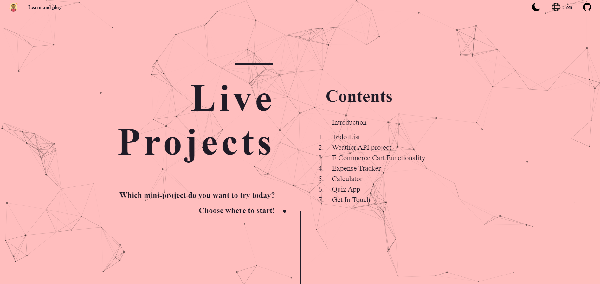
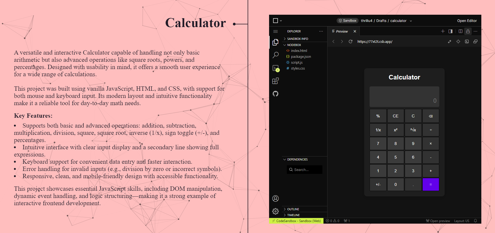

# 🌐 Multi-language Landing Page with Dark Mode & Live projects

This is a responsive landing page featuring:

- 🎨 **Light/Dark mode toggle**
- 🌐 **Multilingual support** (English, Russian, Ukrainian)
- 🕸️ **Particles background animation (via Particles.js)**
- 💤 **Lazy-loaded iframes**
- 📱 **Responsive and mobile-friendly design**

## 🚀 Features

- **Dark Mode**: Automatically adapts to system preferences or manual toggle.
- **Language Switcher**: Dynamically switches between English, Russian, and Ukrainian using JSON translation.
- **Particles.js**: Beautiful animated background with theme-specific configuration.
- **Lazy Loading Iframes**: Improves performance by loading embedded content only when visible.

## 🛠️ Technologies Used

- HTML5 & CSS3 (SASS-ready)
- JavaScript (Vanilla)
- Particles.js
- LocalStorage API
- Intersection Observer API

## 🖼️ Preview

> 

> 

## 🧪 How to Use

1. Clone the repository:
   ```bash
   git clone https://github.com/thrillu4/live-project.git
2. Open index.html with [Live Server](https://marketplace.visualstudio.com/items?itemName=ritwickdey.LiveServer) in your browser.

3. Edit content, styles, or scripts as needed.


## 🧠 Author

Made with ❤️ by Denys K.

GitHub: [thrillu4](https://github.com/thrillu4)
